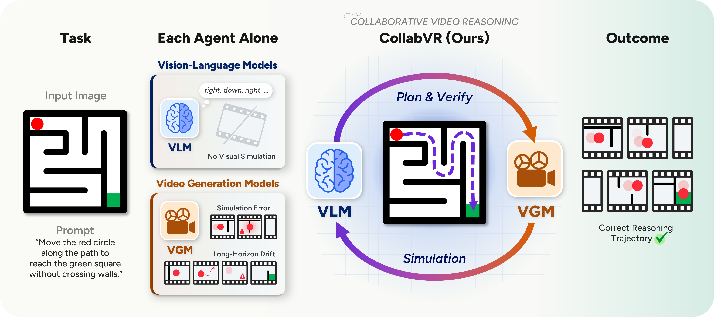
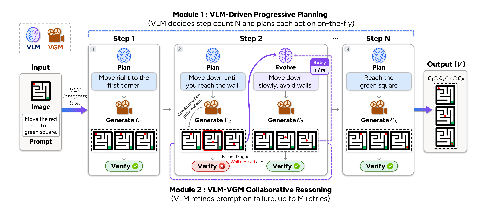

# CollabVR

Official code release for **CollabVR: Collaborative Video Reasoning with Vision-Language and Video Generation Models**.

- Project page: <https://joow0n-kim.github.io/collabvr-project-page/>
- Paper: TBD (arXiv link forthcoming)

## Overview



A Vision-Language Model (VLM) is strong at logical reasoning but weak at visual simulation; a Video Generation Model (VGM) simulates short clips faithfully but lacks reasoning. This mismatch surfaces as two recurring failures on goal-directed tasks: **long-horizon drift** when a single prompt specifies a multi-step task, and **mid-clip simulation errors** that propagate through subsequent frames. CollabVR couples the two models in a closed loop: the VLM plans the immediate next action, inspects the clip the VGM produces, and routes test-time compute across qualitatively distinct recovery strategies (re-generation, action splitting) matched to the diagnosed failure.

## Pipeline



At each step *t*, the VLM emits a single action *a<sub>t</sub>* conditioned on the current frame, task prompt, and history. The VGM renders a clip *c<sub>t</sub>*, which the VLM verifier accepts or rejects with a diagnosed failure mode *d*. Two complementary modules consume that signal:

- **M1 — Progressive Planning.** Per-state adaptive selection of the number of sub-steps *N*. Atomic transformations stay at *N=1*; multi-step tasks expand *N>1* only when the verifier indicates that the single-shot stream cannot complete the task.
- **M2 — Verification + Re-generation.** On reject, prompt evolution updates *a<sub>t</sub>* using the diagnosis *d* and the clip is re-sampled up to a budget *M*. If all *M* attempts are rejected, the framework routes to a recovery strategy chosen from *d*.

The two modules address different failure modes (long-horizon drift vs. mid-clip error) and are activated independently per state.

## Status

The code is being prepared for release. The repository will include:

- [ ] Inference pipeline (planner / verifier prompts, VGM backends: Veo 3.1, VBVR-Wan2.2)
- [ ] Evaluation (Gen-ViRe, VBVR-Bench)
- [ ] Environment / API-key setup

## Citation

```bibtex
@article{kim2026collabvr,
  title   = {CollabVR: Collaborative Video Reasoning with Vision-Language and Video Generation Models},
  author  = {Kim, Joowon and Shin, Seungho and Park, Joonhyung and Yang, Eunho},
  journal = {arXiv preprint},
  year    = {2026}
}
```
